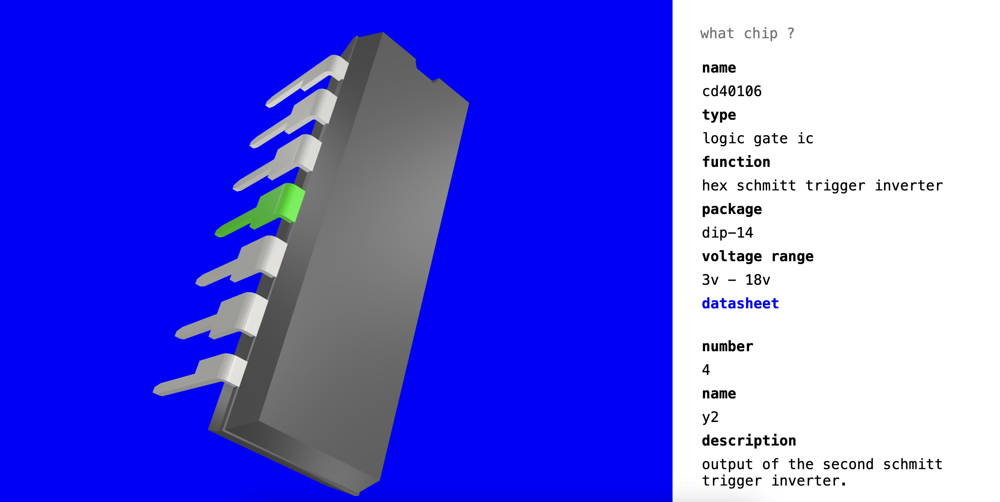

## 3Data Sheets

**3Data Sheets** is an interactive 3D-based project that provides visual and structured information about **100+ CMOS 4000 series ICs**, including logic gates, counters, and more. using **X3DOM** to render 3D models of ICs and allows users to explore each component in an interactive manner.

#### Features

- **Search Functionality**: Enter an IC code to dynamically load its corresponding **3D model**.
- **Detailed IC Information**: Displays essential details such as:
  - IC name and type
  - Functionality
  - Physical size
  - Number of pins
  - Voltage range
  - Direct link to the official **datasheet**
- **Interactive Pin Selection**: Clicking on a pin highlights it and shows:
  - Pin number
  - Pin name
  - Pin function

#### Why?

This project is an experimental attempt to reimagine how IC data can be explored. Instead of traditional datasheets, it offers a playful and interactive way to engage with IC information in 3D, providing a different perspective rather than a purely practical tool.

In the future, I may add many more ICs like **74xx, ATmega, ATtiny**, and other types.
